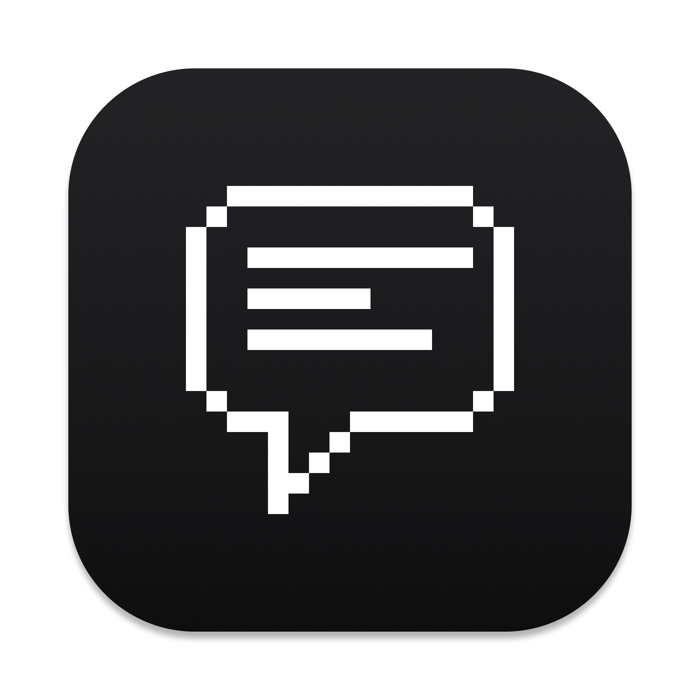

<p align="center">
  
</p>

<h1 align="center">Debrief</h1>

<p align="center">Meeting notes that write themselves. Everything runs on your Mac.</p>

---

Debrief sits in the menu bar. Hit record during a meeting; when you stop, it
transcribes the audio and writes you a Markdown note - summary, decisions,
action items, full transcript - with the recording saved next to it.

No account, no API key, no cloud, no telemetry. Transcription is NVIDIA
Parakeet (the same engine as UltraWhisper) and the summary is a small
open-source model, both running on this Mac. They download themselves the
first time the app runs.

```
~/Debrief/
  2026-08-21-1430.md    the note
  2026-08-21-1430.m4a   the recording
```

## Install

The only prerequisite is [Node.js](https://nodejs.org).

```bash
git clone git@github.com:MaxOLeary/debrief.git
cd debrief
npm run setup                        # npm modules + AI models (~3 GB, one time)
./scripts/build-app.sh --install     # -> /Applications/Debrief.app
open -a Debrief
```

A hollow circle appears in the menu bar - that icon is the whole app. The
first time you record, macOS asks for the **Microphone** (a plain Allow
button). Always launch from Finder or `open -a Debrief`, never by running the
binary from a terminal, or the permission gets credited to the terminal.
Same reason to use the built app instead of `npm start`: run from source,
the permission lands on "Electron" inside `node_modules` and the next
`npm install` throws it away.

Out of the box Debrief records **your microphone only**, so a video call
comes back as your side of it. Capturing the other people takes one setting
and one scary-looking macOS dialog; see EXTRAS.

## Using it

| Do | What happens |
|---|---|
| ⌘⇧R, or the menu | Recording starts and a floating waveform card appears. |
| ⌘⇧R again, or **Stop** on the card | The card shows live progress, then your note is ready. |
| **Cancel** on the card (or Esc, with the card focused) | Asks "Discard recording?" - confirm and the take is deleted, nothing saved. |

When the note is ready you get a notification; click it to open the note.
The menu can also open it in Obsidian, Postit, or Apple Notes.

## If something goes wrong

- The log is at `~/Library/Logs/Debrief.log` (menu: **Open Log**).
- If processing fails, the raw audio is kept and the error dialog has a
  **Show Raw Audio** button - a bad run never costs you the recording.
- Transcript is only you? That's the mic-only default; `SYSTEM_AUDIO=1`
  captures the far side (EXTRAS explains the permission it needs).
- Can't see the menu bar icon? A hidden or crowded menu bar swallows it -
  ⌘⇧R works regardless.

Everything else - configuration, recording the far side of a call, opening
notes in other apps, SketchyBar, start at login, self tests - lives in
[EXTRAS.md](EXTRAS.md).
